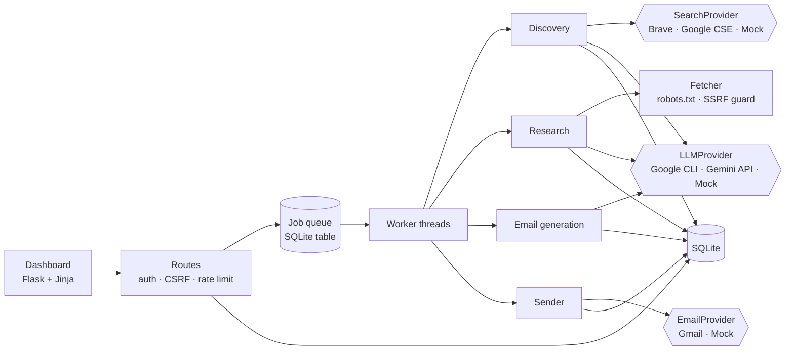

# Sponsor Scout

AI-assisted sponsor discovery and outreach for college events. Give it an event; it finds companies that could sponsor it, researches each one from public pages, scores sponsorship fit with an explainable rubric, finds public contacts, drafts a personalised email whose every factual claim links to a source, and sends through Gmail **only after a human approves it**.

```
Event → Discover → Filter → Research → Score → Contacts → Draft → Review/Approve → Gmail send → Track
```

Contributors and coding agents: read [`AGENTS.md`](AGENTS.md) for architecture, invariants, current status, known issues and next steps.

## Contents
1. [Quick start (demo mode)](#1-quick-start-demo-mode)
2. [Run it for real](#2-run-it-for-real)
3. [Find sponsors for your event](#3-find-sponsors-for-your-event)
4. [How it works](#4-how-it-works)
5. [Configuration](#5-configuration)
6. [Development and testing](#6-development-and-testing)
7. [Deployment](#7-deployment)
8. [Known limitations](#8-known-limitations)

## 1. Quick start (demo mode)

Demo mode needs no keys: fictional companies, a mock LLM and a mock mailer. Nothing leaves your machine.

```bash
pip install -r requirements.txt     # Python 3.11+
python run.py                       # http://localhost:5000  (development password: demo)
```

In the app: **Dashboard → New event** → watch the job bar → open a lead → **Generate email** → **Approve** → **Connect demo sender** → **Send**.

## 2. Run it for real

Three things need real credentials. All are configured in `.env` (copy `.env.example`; `.env` is gitignored).

### 2.1 LLM: your Google AI Pro account via Google's CLI
A Google AI Pro subscription is not an API key, and this app never asks for one. It launches Google's official command-line agent as a child process and uses **the sign-in you performed yourself**; the CLI keeps its own credentials and the app never sees them.

Current state (checked 2026-10-02): Google stopped serving Gemini CLI to AI Pro/Ultra and free individual accounts on 2026-06-18. The replacement is **Antigravity CLI (`agy`)**, so `agy` is the default. The legacy `gemini` binary still works for API-key, Vertex or Gemini Code Assist Standard/Enterprise users via `LLM_CLI_BIN=gemini`.

1. Install Antigravity CLI from Google's official instructions, run `agy` once and choose **Sign in with Google** with your AI Pro account.
2. In `.env`: `LLM_PROVIDER=cli` (leave `GEMINI_API_KEY` empty). Optionally `LLM_CLI_MODEL=<model id your CLI lists>`.
3. Run `make llm-check`. It must end with `OK: the provider answered.`

Behaviour and guard rails: one headless call per task (`agy --output-format json -p "<prompt>"`); no tool permissions are granted and the agent runs in an empty temp directory; the child process gets an allow-listed environment, so app secrets are not inherited; quota or sign-in errors are reported and **never retried or worked around**; one call at a time by default (`LLM_CLI_CONCURRENCY=1`). Usage counts against your subscription's own limits, so set `LLM_FIT_ANALYSIS=0` and `LLM_EMAIL_REVIEW=0` to drop the two optional extra calls per lead/draft. Check Google's current terms to confirm scripted, single-user use is acceptable for your plan.

> The CLI route has been tested against a fake CLI executable only, not a live account. Run `make llm-check` first; if the real output differs, adjust `build_argv` / `parse_envelope` in `app/llm/cli.py`.

*Optional fallback:* `LLM_PROVIDER=gemini` with `GEMINI_API_KEY` (a separate, separately billed or free-tier product). `python -m app.cli models` lists the models your key can call.

### 2.2 Search: company discovery
Create a free key at Brave Search API and set `SEARCH_PROVIDER=brave`, `BRAVE_API_KEY=...` (or `google_cse` with `GOOGLE_CSE_KEY` and `GOOGLE_CSE_CX`). No paid search? Use `SEARCH_PROVIDER=list` with your own CSV of company sites (section 3). The app does not scrape search engines. Its page fetcher respects `robots.txt`, identifies itself, rate-limits per host, caps page size and redirects, and refuses private addresses.

### 2.3 Gmail: sending
1. Google Cloud Console → new project → enable the **Gmail API**.
2. OAuth consent screen → External → add yourself as a **test user**.
3. Credentials → OAuth client ID → Web application → redirect URI `http://localhost:5000/gmail/callback`.
4. In `.env`: `MAIL_PROVIDER=gmail`, `GOOGLE_CLIENT_ID`, `GOOGLE_CLIENT_SECRET`; set `SENDER_NAME`, `SENDER_ROLE`, `SENDER_ORG`.
5. In the app click **Connect Gmail** and approve. Only `gmail.send` (plus `openid email`) is requested; no password is stored and the refresh token is encrypted at rest.

While the consent screen is in *Testing*, Google expires refresh tokens after about 7 days; reconnect when asked. Start with 2–3 emails to yourself.

## 3. Find sponsors for your event

Keep your own event details out of the repo: `local/` is gitignored, so put your event file and sponsor list there.

```bash
mkdir local
cp events/example-event.json local/my-event.json   # fill in every REPLACE value (the command refuses to run while one remains)
make event FILE=local/my-event.json                 # discovery + research; a long list takes a while with the CLI LLM
python run.py                                       # then open http://localhost:5000
```

In the app: **Leads** (sorted by fit score) → open a lead → check evidence and the public contact → **Generate email** → edit → **Approve** → **Send**. Companies with no public contact cannot be emailed unless you add a verified contact yourself. With `MAIL_PROVIDER=mock` nothing is ever sent, so you can draft emails and send them yourself.

**No search API key?** Set `SEARCH_PROVIDER=list` and `SEARCH_LIST_FILE=local/my-sponsors.csv`: a CSV with columns `name,url,note` of companies you want to approach (see `events/example-sponsor-list.csv`). The LLM still filters it for relevance and every company is researched from its own website, so the `note` column is never used as evidence. Raise `MAX_DISCOVERY_CANDIDATES` above 40 for a longer list.

**Barter mode** applies to any event whose requested sponsorship types contain no cash/money/fund term: the email prompt forbids asking for money, suggested asks favour credits, licences, prizes and swag, and the quality gate warns if a draft mentions cash, budget or payment.

## 4. How it works



| Concern | Where |
|---|---|
| LLM abstraction (`generate`, `generate_json`) | `app/llm/` (`cli.py` Google CLI, `gemini.py` API key, `mock.py`) |
| Search abstraction | `app/search/` |
| Discovery, filtering | `app/discovery.py` |
| Fetch, extract facts, contacts | `app/research/` |
| Fit score (rule-based, explainable) | `app/scoring.py` |
| Email generation, quality gate | `app/emailgen.py`, `app/quality.py` |
| Approval, send guards, duplicate protection | `app/sending.py`, partial unique indexes in `app/db.py` |
| Gmail OAuth (PKCE), encrypted token store | `app/mailer/` |
| Job queue and worker | `app/jobs.py` |
| Routes, security | `app/web.py`, `app/security.py` |

**Data:** SQLite at `data/app.db` with proper entities: `events`, `companies`, `company_research`, `research_sources`, `contacts`, `campaigns`, `leads`, `email_drafts`, `email_sends`, `jobs`, `audit_logs`, `oauth_accounts`. JSON columns hold only flexible research data. Research is cached per company and shared across events.

**Jobs:** research and drafting run asynchronously; the UI shows `QUEUED`, `RUNNING`, `COMPLETED` or `FAILED`.

### How hallucinations are prevented
- Facts are extracted deterministically: each is a verbatim sentence from a fetched page plus its URL (`F1`, `F2`, ...). Anything unverifiable is `unknown`.
- The LLM only summarises. Any product or launch claim must carry a quote that exists word for word on the cited page, or it is discarded.
- **The score never uses the LLM**; every evidence line comes from extracted facts. The six dimensions are Student Audience, Technology Relevance, Sponsorship History, India Presence, Developer/Community Focus and Event Scale.
- Contacts are only emails that literally appear on public pages, stored with their source and a confidence. Nothing is guessed; no email means `not_found`.
- The email model must cite fact ids for each personalised sentence. Unknown ids are dropped; no valid citation means the draft is **blocked**. Numbers that appear in neither the event brief nor the cited facts raise a warning.
- AI commentary (fit analysis, draft fact-check) is advisory: a "strength" needs real fact ids, a flagged sentence must literally appear in the email, and these checks can only add warnings.

### Draft statuses and send protection
`DRAFT` · `NEEDS_REVIEW` (warnings; approval needs an acknowledgement) · `APPROVED` · `SENT` · `FAILED` · `REPLIED` · `BOUNCED`. Blocking problems (no valid recipient, no evidence, absurd length) cannot be approved, and editing a draft resets approval.
- Duplicates are prevented for company (unique domain and normalised name), mailbox (case, `+tag` and Gmail dots normalised; partial unique index on live sends) and one live send per company per campaign.
- 90-day company cooldown across campaigns, a daily cap per campaign, a minimum gap between sends, and pause/resume. Every email carries a plain opt-out line. Nothing here evades spam filtering.

## 5. Configuration

`.env.example` is the authoritative list. Key variables:

| Variable | Purpose |
|---|---|
| `APP_ENV` | `development` or `production` (production requires `SECRET_KEY` of 32+ chars and `ADMIN_PASSWORD`) |
| `SECRET_KEY` | Signs sessions and derives the key that encrypts OAuth tokens at rest |
| `LLM_PROVIDER` | `mock` (default) · `cli` (Google account via CLI) · `gemini` (API key) |
| `LLM_CLI_BIN`, `LLM_CLI_MODEL`, `LLM_CLI_TIMEOUT_SECONDS`, `LLM_CLI_CONCURRENCY` | CLI route settings |
| `LLM_FIT_ANALYSIS`, `LLM_EMAIL_REVIEW` | Optional advisory AI steps (`1`/`0`) |
| `GEMINI_API_KEY`, `GEMINI_MODEL` | Only for `LLM_PROVIDER=gemini` |
| `SEARCH_PROVIDER` | `mock` / `brave` (`BRAVE_API_KEY`) / `google_cse` (`GOOGLE_CSE_KEY`, `GOOGLE_CSE_CX`) / `list` (`SEARCH_LIST_FILE`: free, a CSV of company sites; `MAX_DISCOVERY_CANDIDATES` caps how many are kept) |
| `MAIL_PROVIDER` | `mock` / `gmail` (`GOOGLE_CLIENT_ID`, `GOOGLE_CLIENT_SECRET`, `GOOGLE_REDIRECT_URI`) |
| `SENDER_NAME`, `SENDER_ROLE`, `SENDER_ORG` | Signature appended to every email |
| `DATABASE_URL` | `sqlite:///data/app.db` |

All values are read server-side only. Never commit `.env`.

## 6. Development and testing

```bash
make dev                  # dev server + worker
make test                 # 199 offline tests, ~10 s, no credentials or network
make check                # byte-compile
make llm-check            # smoke-test the configured LLM provider
make event FILE=events/<file>.json   # create an event from a preset and find sponsors
python -m app.cli seed --full        # demo event, discovery and research run synchronously
python -m app.cli worker             # worker only (with WORKER_ENABLED=0 on the web process)
```

The suite covers normalisation, scoring, fact and contact extraction, a real-socket HTTP fetcher (robots, redirects, SSRF guard, hostile pages), search adapters, prompt construction, the email quality gate, the CLI provider (against a fake executable: argv, environment isolation, quota/auth handling, timeouts, JSON repair), advisory AI review (invented findings ignored), the Gemini API provider and Gmail OAuth/send (mocked HTTP), the job queue, duplicate protection, the approval gate, rate limits, CSRF/auth, secret redaction, barter mode, and an end-to-end walkthrough through the HTTP routes.

## 7. Deployment

```bash
pip install gunicorn
APP_ENV=production SECRET_KEY=... ADMIN_PASSWORD=... \
gunicorn -w 1 --threads 8 -b 0.0.0.0:8000 'app:create_app()'
```
- Run **one process**: the rate limiter is in memory and SQLite plus the in-process worker assume a single instance. Scale with threads.
- Terminate TLS in front (nginx/Caddy); session cookies are `Secure` in production.
- Back up `data/app.db`. Keep `SECRET_KEY` stable: changing it makes stored OAuth tokens undecryptable and Gmail must be reconnected.
- Verify your Google OAuth app (sensitive scope) before using it beyond test users.

## 8. Known limitations
- Flask + SQLite, not Next.js + PostgreSQL. The schema is plain relational SQL isolated in `app/db.py` and `app/repo.py`, so a Postgres port is mechanical but not done.
- **Not exercised against live services:** the Google CLI route, Gemini API, Brave/Google search, Gmail OAuth/send and crawling real websites are tested against fakes and mocked HTTP only. Expect small API-shape fixes on the first live run.
- Google AI Pro usage limits are not published as a stable number; heavy discovery runs may exhaust them. The app reports this rather than retrying.
- The fetcher does not run JavaScript, and fact extraction is keyword-rule based, so it can miss or over-count signals. Discovery's "why relevant" note is model-written from search snippets and labelled unverified.
- Replies and bounces are marked manually (automatic detection needs a restricted Gmail scope). Single admin password, no multi-user roles.
- You are responsible for lawful outreach (consent and opt-out rules in your jurisdiction) and for honouring replies asking you to stop.
