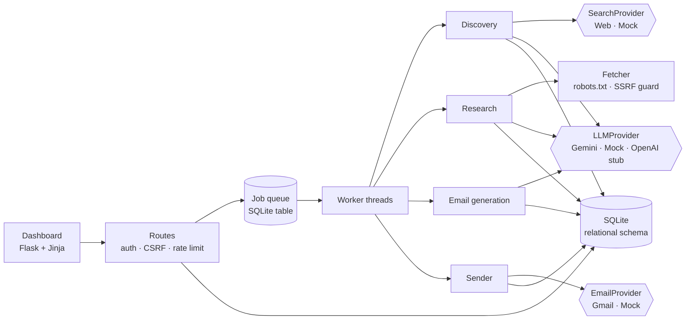

# Sponsor Scout: AI event-sponsor discovery and outreach

> Working in **a coding agent**? Start with [`AGENTS.md`](AGENTS.md): architecture, invariants, status, known issues and next steps. `make test`, `make dev` etc. are in the `Makefile`.

Give it a college event. It finds companies that could sponsor it, researches each one from public pages, scores sponsorship fit with an explainable rubric, finds public contacts, drafts a personalised email whose every factual claim links to a source, and sends through Gmail **only after a human approves it**.

```
Event → Discover → Filter → Research → Score → Contacts → Draft → Review/Approve → Gmail send → Track
```

It runs fully offline in **demo mode** (fictional companies, mock LLM, mock mailer), so you can try the whole flow with no keys.

## Quick start

```bash
pip install -r requirements.txt
python run.py                     # http://localhost:5000  (dev password: demo)
python -m unittest discover -s tests -t .   # 145 tests, no credentials needed
```

In the UI: **Dashboard → Create event and find sponsors** → watch the job bar → open a lead → *Generate email* → *Approve* → *Send*. In demo mode click **Connect demo sender** first; nothing leaves your machine.

## Architecture



| Concern | Where |
|---|---|
| LLM abstraction (`generate`, `generate_json`) | `app/llm/` (Gemini REST provider, Mock, OpenAI stub) |
| Search abstraction | `app/search/` (Brave and Google CSE adapters, Mock) |
| Discovery, filtering | `app/discovery.py` |
| Fetch, extract facts, contacts | `app/research/` |
| Fit score (rule-based, explainable) | `app/scoring.py` |
| Email generation, quality gate | `app/emailgen.py`, `app/quality.py` |
| Approval, send guards, duplicate protection | `app/sending.py`, partial unique indexes in `app/db.py` |
| Gmail OAuth (PKCE), encrypted token store | `app/mailer/` |
| Job queue and worker | `app/jobs.py` |
| Routes, security | `app/web.py`, `app/security.py` |

### How hallucinations are prevented
- **Facts are extracted deterministically**: each is a verbatim sentence from a fetched page plus its URL (`F1`, `F2`, ...).
- The LLM only **summarises**. Any product or launch claim it returns must carry a quote that exists word for word on the cited page, or it is discarded (and counted in the UI).
- **The score never uses the LLM.** Every evidence line in a score comes from the extracted facts.
- **Contacts are only emails that literally appear on public pages.** Nothing is guessed. No email means `contact_status = not_found`.
- The email model must cite fact ids per personalised sentence. Unknown ids are dropped; no valid citation means the draft is **blocked** from approval. Numbers in the body that appear in neither the event brief nor the cited facts raise a warning.
- Lead detail shows "why each claim was written", with the fact and its source URL.

### Draft statuses
`DRAFT` · `NEEDS_REVIEW` (quality warnings; approval requires ticking an acknowledgement) · `APPROVED` · `SENT` · `FAILED` · `REPLIED` · `BOUNCED`. Blocking problems (no valid recipient, no evidence, absurd length) cannot be approved at all. Editing a draft resets approval.

### Duplicate and send protection
- Company: unique `domain` and `normalized_name` (legal suffixes stripped, case and punctuation folded).
- Mailbox: normalised (case, `+tag`, Gmail dots) and enforced by a partial unique index on live sends. It holds even if app logic is bypassed.
- One live send per company per campaign (partial unique index). 90-day cooldown across campaigns (`COMPANY_COOLDOWN_DAYS`).
- Campaign daily cap (`CAMPAIGN_DAILY_LIMIT`), minimum gap between sends (`SEND_INTERVAL_SECONDS`, via job deferral), pause/resume per campaign.
- Every email carries a plain opt-out line. There is nothing that evades spam filtering.

## Environment variables
See `.env.example`. Key ones:

| Variable | Purpose |
|---|---|
| `APP_ENV` | `development` or `production`. Production refuses to start without `SECRET_KEY` (≥32 chars) and `ADMIN_PASSWORD` |
| `SECRET_KEY` | Signs sessions and derives the key that encrypts OAuth tokens at rest |
| `GEMINI_API_KEY`, `GEMINI_MODEL` | Gemini access and model id. Empty `GEMINI_MODEL` auto-discovers (see below) |
| `SEARCH_PROVIDER` | `mock` / `brave` (`BRAVE_API_KEY`) / `google_cse` (`GOOGLE_CSE_KEY`, `GOOGLE_CSE_CX`) |
| `GOOGLE_CLIENT_ID`, `GOOGLE_CLIENT_SECRET`, `GOOGLE_REDIRECT_URI` | Gmail OAuth |
| `SENDER_NAME`, `SENDER_ROLE`, `SENDER_ORG` | Signature appended to every email |
| `DATABASE_URL` | `sqlite:///data/app.db` (see limitations) |

Provider defaults: `LLM_PROVIDER` is `gemini` if a key is set, else `mock`; `MAIL_PROVIDER` is `gmail` if a client id is set, else `mock`.

## Gemini API setup
1. Create a key in Google AI Studio and put it in `GEMINI_API_KEY`.
2. Run `python -m app.cli models` to list what **your key** can call. The app ranks stable text models first (newest version, pro > flash > flash-lite), then previews.
3. To use a specific model, set `GEMINI_MODEL` to the exact id the command prints (for example a `gemini-3.x` id). If the id you want is not in that list, it is not available through the API for your account; the app will not fake it. A wrong id produces an error telling you to run the command above.

## Search setup
Discovery needs a search API. Set `SEARCH_PROVIDER=brave` with `BRAVE_API_KEY`, or `google_cse` with a Programmable Search key and engine id. The app does not scrape search engines. The fetcher respects `robots.txt`, identifies itself, rate-limits per host, caps page size and redirects, and refuses private/loopback addresses (SSRF guard).

## Google OAuth setup (Gmail)
1. Google Cloud Console → new project → **Enable the Gmail API**.
2. **OAuth consent screen** → External → add yourself as a **test user**.
3. **Credentials → OAuth client ID → Web application**. Add the redirect URI `http://localhost:5000/gmail/callback` (and your production URL later).
4. Put the id, secret and redirect URI into `.env`, set `MAIL_PROVIDER=gmail`, restart.
5. Click **Connect Gmail**, choose the account, approve. Only the `gmail.send` scope (plus `openid email`) is requested. No password is ever stored; the refresh token is encrypted at rest.

Note: while the consent screen is in *Testing*, Google expires refresh tokens after about 7 days, so you will need to reconnect. Sending to many recipients from a personal account is subject to Google's own sending limits.

## Database
SQLite file at `data/app.db`, created automatically. Entities: `events`, `companies`, `company_research`, `research_sources`, `contacts`, `campaigns`, `leads`, `email_drafts`, `email_sends`, `jobs`, `audit_logs`, `oauth_accounts`. JSON is used only for flexible research metadata (facts, profile, score breakdown).

## Development
```bash
python run.py                        # dev server + in-process worker, seeds the demo event
python -m app.cli seed --full        # create demo event and run discovery/research synchronously
python -m app.cli models             # list Gemini models for your key
python -m app.cli worker             # worker only (when WORKER_ENABLED=0 on the web process)
```

## Testing
`python -m unittest discover -s tests -t .` runs 145 offline tests: normalisation, scoring, fact/contact extraction, real-socket HTTP fetcher (robots, redirects, SSRF guard, hostile pages), search adapters, prompt construction, email generation and quality gate, Gemini provider (mocked HTTP), Gmail OAuth/send (mocked HTTP), job queue, duplicate protection, approval gate, rate limits, CSRF/auth, secret redaction, and a complete end-to-end walkthrough through the HTTP routes. Safety tests were mutation-checked (removing the duplicate index, the approval check, CSRF, quote verification, the no-guessing rule, or log redaction makes tests fail).

## Production deployment
```bash
pip install gunicorn
APP_ENV=production SECRET_KEY=... ADMIN_PASSWORD=... \
gunicorn -w 1 --threads 8 -b 0.0.0.0:8000 'app:create_app()'
```
- **Run one process.** The rate limiter is in memory and SQLite plus the in-process worker assume a single instance. Scale with threads.
- Terminate TLS in front (nginx/Caddy). Session cookies become `Secure` in production.
- Back up `data/app.db`. Keep `SECRET_KEY` stable; changing it makes stored OAuth tokens undecryptable (you reconnect Gmail).
- Verify your Google OAuth app (sensitive scope) before using it beyond test users.

## Known limitations
- **Stack differs from the brief.** Built as Flask + Jinja + SQLite, not Next.js + PostgreSQL. The build environment had no package registry, and a Node toolchain could not be installed or tested. The schema is plain relational SQL and the data layer is isolated in `app/db.py` and `app/repo.py`, so porting to Postgres is mechanical but not done.
- **Live integrations were not exercised against real services.** Gemini, Brave/Google search, Gmail OAuth and the HTTP fetcher are unit-tested against mocked HTTP, but this build had no credentials or network. Expect to fix small API-shape surprises on first live run; start with 2-3 test sends to yourself.
- Demo mode uses **fictional companies** and a deterministic mock LLM. Real Gemini emails will read more naturally; they pass through the same evidence and quality checks.
- The fetcher does not run JavaScript, so JS-only sites yield little. Research is limited to a handful of same-site pages per company, and fact extraction is keyword-rule based, so it can miss or over-count signals.
- Discovery's "why relevant" note is written by the model from search snippets and is labelled unverified in the UI. Only extracted facts count as evidence.
- Replies and bounces are marked manually. Automatic detection would need a Gmail read scope, which is a restricted scope.
- Single admin password, no multi-user roles. The send audit trail records actor `admin`.
- OpenAI provider is an intentional stub.
- You are responsible for lawful outreach (consent and opt-out rules in your jurisdiction) and for honouring replies asking you to stop.
